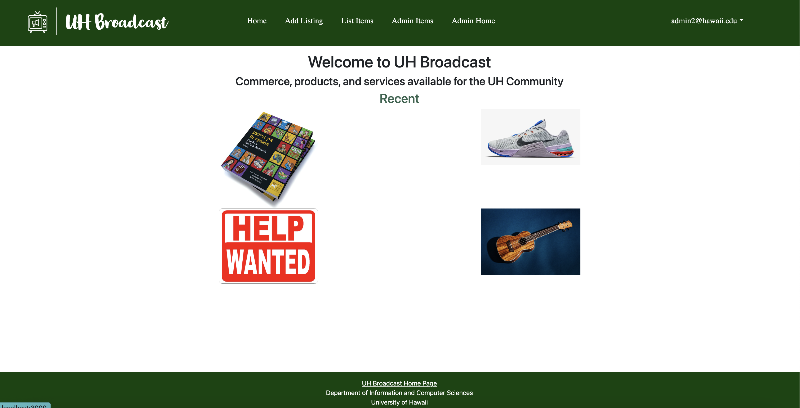

## What is Design?

Design has been one of the most crucial parts of a website, application, game, and more. To create something for consumer use, is to use design. Design allows for better communication from creator to user. Design can encompass the style of a webpage, how particular parts of an application is accessed, the designated text or images to be shown to the user, or simply how information is portrayed.

## Use of Design

Considering the prevelance of design across multiple platforms, design is one of the best ways to grab the attention and entice a user. Whether it be allowing for the user to better access what they intend to achieve or drawing them in, by better portrayal of information it helps to better develop and cultivate a platform for the intended audience.
 
 
Below is an example of what a website design may look like:

 

 

## Why Design?

Design is the best way to reach a user. However, such as the image above, proper design helps to cultivate better application and collaboration. By setting a basis for proper design, it helps to develop and add multiple features for users that would help to better represent what user would desire to access or achieve from using a given application, website, etc.
 
 
By using design patterns to communicate components of webpages or applications, I was able to improve upon user interface and both website and app development.
