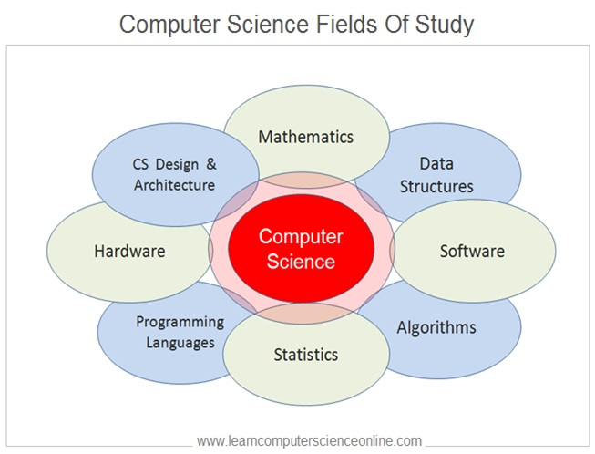

# How do I See CS

Computer Science (CS) is a topic that I gradually grew interest in as I got more and more intertwined with technology. In some ways, there is no hard set definition of what CS really is. In a way, each person has their own interpretation of what they would define as computer science, and some focusing on it can further define CS to a curated interest they may have. In the encompassment of what computer science can be, I have yet to fully define it for myself. 

## What Exists in Computer Science?

In the technical aspect, computer science can encompass myriad topics ranging from software engineering, data science, algorithms, cybersecurity, and many more. Each of which can be utilized for the creation of solutions, efficiency, quality of life, and many reasons of which vary per topic. While there exists a demand for computer scientists, it reasonably can be encompassed within the infrastructure of businesses and lifestyles worldwide. However, all of which was not quite apparent to me before I chose this major. 

## Origins
My interest in computer science stems from the involvement I had with computers as I grew up, amplifying as I learned more and more about the technical aspect of previously mentioned topics that could be employed as solutions, creations, or stability within regular livelihoods. The more I was able to apply what I learned, the more invested I was. Furthermore, it ultimately led to me learning much more of computer science.

In my personal perspective, computer science is something that I initially found an interest in without even fully knowing the subject. Believe it or not, having been exposed to it as much as I have, I can confidently say that there is a ton to it that I do not fully understand yet. Similarly, it is still something that I cannot confidently fully commit a definition for. However, I believe that rather than defining it by topics it encompasses, I would define it through the known subjects that it exhibits.

## My Definition of Computer Science
How I see CS is three subjects wrapped in one.
I would define computer science as the culmination of engineering, science, and mathematics. While there exists myriad interpretations from historical figures of computer science, I feel this fits in a broad scale of interpretation for what CS encompasses. While we provide solutions similar to engineering, there exists a scientific aspect of curiosity and theorizing observations. Similarly, there exists a prominence in mathematics among the computational factors that can be most of what computer scientists do.

Of course, don’t just take my word for it, ask any other computer scientist you know.
After all, they may also have their own interpretation.
