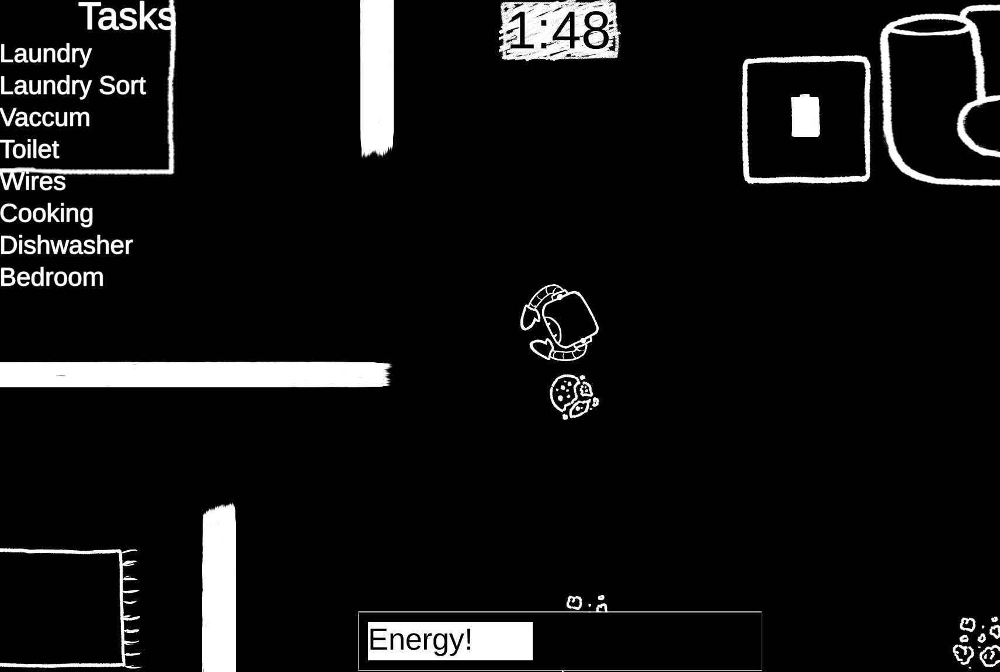
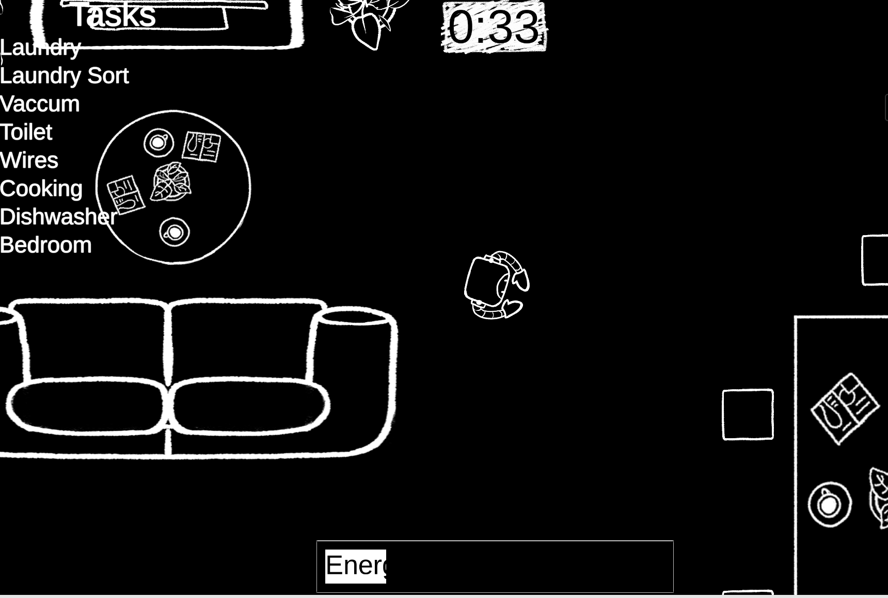

<div class="text-center p-4">
  
</div>

Clean Sweep was a game I contributed to building that uses the Unity Game Engine. The game is hosted on [itch.io](https://itch.io/) and was created during the duration of the [2022 Eighth Black and White Jam](https://itch.io/jam/black-and-white-jam-8). We created this game under the guidelines of following a Black and White colorscheme, while also focusing on a theme of Loop. Through playing Clean Sweep, it essentially is a task simulator, where the Player is a robot designed to complete  every task listed in the top left within a certain timer. The twist, however, is that the Player is also limited by a certain value of Energy that gradually decays overtime. This changes when moving the robot back to the middle in the Charging Station, where the Player regainns energy. Essentially, we envisioned the act of moving to the task, back to the station, as a method of creating a "Loop" to fit the theme. By the use of Github for collaboration, Unity for coding, and Krita for art assets, I was able to push my contributions in this group project with a total of about eight people on behalf of the UH Game Dev Club.

During the creation of the game I learned much more about C# programming, specifically C# programming within Unity. In Unity, there exists Scripts that essentially allow the game to function by providing the coding aspect to execute mechanics and features. In a similar fashion, there is a big emphasis on the art assets and animations that Unity can also include and portray. What surprised me was the amount of physics and additional features within Unity such as the implementation of Rigidbodies or Collision that essentially enforced how that object (for instance the Player) interacts with the environment or other objects around them. I did get to also learn a bit about art creation and importing due to one instance where I needed an asset to cover one of the tasks I was working on.

In specific terms, I was able to create an art asset for part of the bed object within the bedroom for the bedroom task. In this Game Jam I was behind the creation for the win condition, timer, UI for the timer, Player energy, energy decay and regeneration, Camera Lock, and previously mentioned Bed Task. I have much thanks to the artists who created image assets that I could use during the creation of above. By combining those, and the scripts I made, it essentially brought out my contribution to the game. All of us contributing was able to push all of our creations through the use of Github and Github Desktop. This worked by creating a new branch off of main (for ourselves), creating a pull request, merge request, then ultimately pushing to main after we created something we would want to add.


Here is an example of one of multiple scripts I wrote, this one in particular detailing the Player energy decay and regeneration:

```c#
using System.Collections;
using System.Collections.Generic;
using UnityEngine;
using UnityEngine.SceneManagement;


public class Player_Energy : MonoBehaviour
{

    [SerializeField] public float Decrease;
    [SerializeField] public float charge;
    // Start is called before the first frame update
    public float maxEnergy = 100;
    public float currentEnergy;
    public GameObject Roomba_Station;
    public Player_Movement Player;
    public Energy energyBar;
    public Vector2 MaxBounds;
    public Vector2 MinBounds;

    void Start()
    {
        currentEnergy = maxEnergy;
        energyBar.SetMaxEnergy(maxEnergy);
    }

    // Update is called once per frame
    void Update()
    {
        //Out of Energy Reset (technically tentative for change)
        if (currentEnergy <= 0)
        {
            // this.gameObject.SetActive(false);
            transform.position = Vector2.Lerp(transform.position, Roomba_Station.transform.position, Time.deltaTime * 100.0f);
            StartCoroutine(StopPlayer());
        }

        //Manual Energy Loss (for testing purposes)
        if (Input.GetKeyDown(KeyCode.Space))
        {
            //LoseEnergy(20);
        }

        //Energy Drain
        currentEnergy -= Time.deltaTime*Decrease;
        energyBar.SetEnergy(currentEnergy);


        //Recharge Station
        if(this.gameObject.transform.position.x <= MaxBounds.x &&
        this.gameObject.transform.position.x >= MinBounds.x &&
        this.gameObject.transform.position.y <= MaxBounds.y &&
        this.gameObject.transform.position.y >= MinBounds.y &&
        currentEnergy <= maxEnergy)
        {
            currentEnergy += Time.deltaTime*charge;
            energyBar.SetEnergy(currentEnergy);
        }
    }

    IEnumerator StopPlayer()
    {
        Player.enabled = false;
        yield return new WaitForSeconds(3.0f);
        Player.enabled = true;
    }
}
```
Below also depicts another image for better reference of the game:

<div class="text-center p-4">
  
</div>

As we submitted this game for the Game Jam, we were ranked out of the other 305 submissions, and held an overall placement of spot #105. Grading was done via specific criterias and how well we fit each one.

If interested, this game is publically available to play on itch.io: [Clean Sweep](https://snekuchan.itch.io/clean-sweep-a-game-about-life-but-its-only-the-mundane-chores-part).
