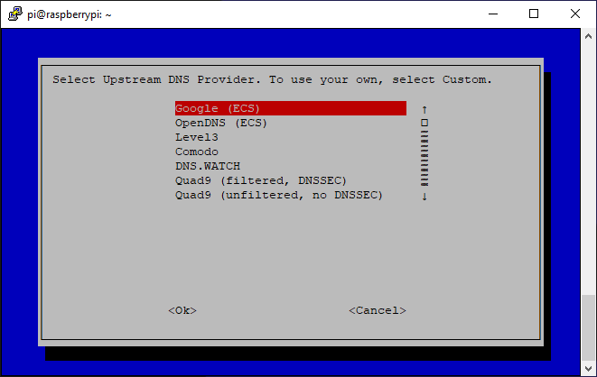
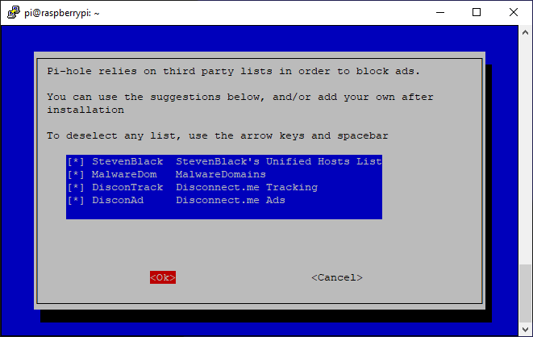
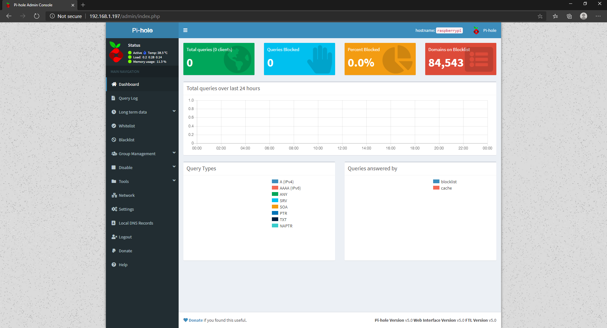

Raspberry Pi's are a essentially a smaller computer that can be programmed to do tasks and host taks similar to what computers are capable of.

A Pi-Hole is a network ad blocker that can be set up to connect to with multiple devices, as would a normal network. Essentially, this setup acts as a filter from ads as the Raspberry Pi is being set up on the normal network for the use of blocking ads.

To get set up, I opened up a commandline to initiate an installer which then prompted the following menu:

  

Throughout the following, it led to adjustable options to define the distributions of ad listings to enforce for the Pi-Hole. In the picture above it also lists the DNS provider to choose from. Below depicts the ad lists to choose from, automatically negating commonly known lists that usually contain ads that may contain malware or tracking info. Commonly, some of these are on Adblocker extensions that we can get from our browser, however, this guarantees that the extension is on even without browser connection, then additionally ensures that all lists can be chosen. 

  

Furthermore, Pi-Hole allows for configuration up to any extra ad sites or lists that you would want to be additionally enforced.   
Below depicts the configuration site for creating additions to the blacklist, in addition to more features.

  

To connect, it can be done by just going to the IP address of the Pi-Hole, similar to what can be done with regular firewalls, then through here it additionally tracks the data of percentage blocks, total domains, the domains that are blocked or allowed, and more of personal configurations and additions. I was able to manage the whitelist and update Pi-Hole settings through this management browser. This showcases and increases comfortability with firewall management and search settings, as it is very similar to firewalls that I have previously worked with, albeit with a focus in ad management.

Setting this up on my home network, I got more comfortable and learned more of commandline, ad listings, the importance of adblock, and I learned and was able to implement hosting options that makes Raspberry Pi's iconic.

For future steps, rather than just implementing a secure home network, I plan to branch off towards setting up a remote VPN that could be connected to while way outside the area of just my home. Instead of only security at home, doing such would allow for better safety practices throughout varying location or for external uses that a VPN could provide. 

